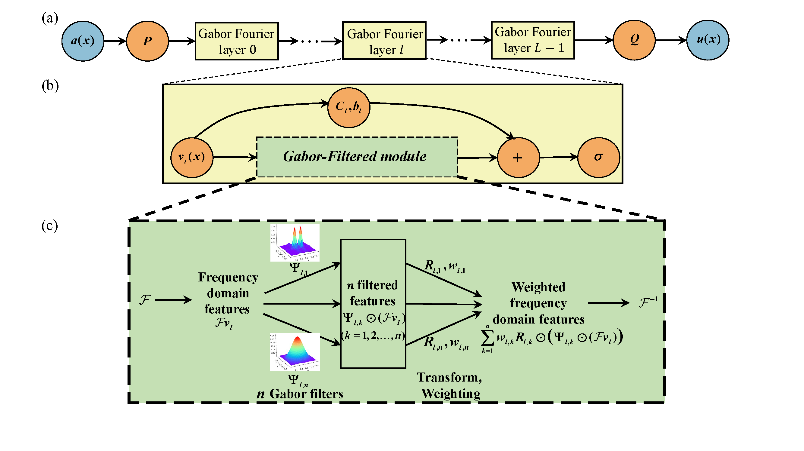

# Gabor-Filtered-Fourier-Neural-Operator
Gabor-Filtered Fourier Neural Operator for Solving Partial Differential Equations (GFNO)

This is the code of the paper "Gabor-Filtered Fourier Neural Operator for Solving Partial Differential Equations".

## Abstract
In this study, we enhance FNO by integrating a learnable Gabor-Filtered module, leading to the Gabor-Filtered Fourier Neural Operator (GFNO).  The frequency transformation matrix is pivotal to the expressiveness of FNO. In the proposed Gabor-Filtered module,  the parametric Gabor filters provide regularization to the elements of the frequency transformation matrix, and it assigns the higher weights to the key frequencies in the frequency domain. This enables the frequency transformation matrix to reduce redundancies and emphasize the key frequency bands. 


## Architecture 



## Environment
python 3.8, torch 1.10, CUDA 11.3

## Dataset
**(1) The datasets of 1d Burgers’ equation, 2-d Darcy Flow equation, and 3-d (2-d + time) Navier-Stokes equation:**

Li, Z., Kovachki, N., Azizzadenesheli, K., Liu, B., Bhattacharya, K., Stuart, A., and Anandkumar A., “Fourier Neural Operator for Parametric Partial Differential Equations”, ICLR, 2021. doi:10.48550/arXiv.2010.08895.

Datasets download: https://drive.google.com/drive/folders/1UnbQh2WWc6knEHbLn-ZaXrKUZhp7pjt-

**(2) The dataset of Mechanical MNIST:**

E. Lejeune, Mechanical mnist: A benchmark dataset for mechanical metamodels, Extreme Mechanics Letters 36 (2020) 100659.

Datasets download: https://drive.google.com/file/d/1UyjKnsL15FUHESO4rUt3Hg_CkFlxoCPz/view

**(3) The datasets of Shallow Water equation, and Climate modeling:**

G. Kissas, J. H. Seidman, L. F. Guilhoto, V. M. Preciado, G. J. Pappas, P. Perdikaris, Learning operators with coupled attention, Journal of
Machine Learning Research 23 (2022) 1–63.

Datasets download: https://drive.google.com/file/d/1UyjKnsL15FUHESO4rUt3Hg_CkFlxoCPz/view


**(4) The datasets of Navier-Stokes equations with increasing Reynolds numbers in Section 6.6 of our paper：**

```
python data_generation_Navier-Stokes_equation/ns_2d.py  --visc 1e-5;
```

## Citation

```
to be confirmed

```

## Acknowledgement
Our model is based on the original work of Fourier Neural Operators:

https://github.com/zongyi-li/fourier_neural_operator

and Learning Operators with Coupled Attention:

https://github.com/PredictiveIntelligenceLab/LOCA


